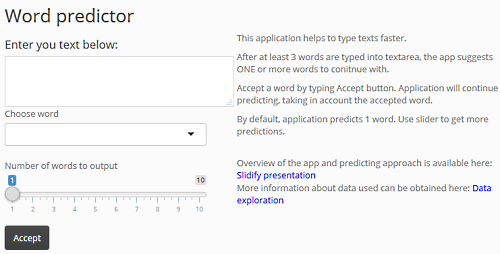

---
title       : Word predictor application
subtitle    : Coursera JHU Data science capstone project 2016
author      : Real Svik
job         : 
framework   : io2012        # {io2012, html5slides, shower, dzslides, ...}
highlighter : highlight.js  # {highlight.js, prettify, highlight}
hitheme     : tomorrow      # 
widgets     : []            # {mathjax, quiz, bootstrap}
mode        : selfcontained # {standalone, draft}
knit        : slidify::knit2slides
--- 

```{r results='hide', echo=FALSE, message=FALSE, warning=FALSE}
library(R.utils)
library(tools)
library(tm)
library(ggplot2)
library(SnowballC)
library(RWeka)
library(wordcloud)
#load("assets/data/dfOne.Robj")

```

<style>
ul li {
    font-size: 14px;
    font-weight: normal;
}
span.descr {
    font-size: 14px;
    font-weight: normal;
    font-family: 'Open Sans', Arial, sans-serif;
}
span.headerSm {
    font-size: 16px;
    font-weight: bold;
    font-family: 'Open Sans', Arial, sans-serif;
    color: #808080;
}
span.headerSB {
    font-size: 16px;
    font-weight: bold;
    font-family: 'Open Sans', Arial, sans-serif;
    color: #737CA1;
}
</style>
# Project overview

<table border=0, width=100%, bgcolor="white">
<tr>
  <td align="left", bgcolor="white", valign="middle">
    <span class="descr">The goal of the project was to build an application to predict next word in a sentence.</span>
    <span class="descr">The project can be defined in the following stages:</span>
    <ul>
      <li> Explore available language sources and identify challenges</li>
      <li> Create language and data model, articulate limitations</li>
      <li> Define the algorythm</li>
      <li> Code the application</li>
      <li>And identify improvement options</li>
    </ul></td>
  <td align="left", bgcolor="white", valign="bottom">
    <span class="headerSB">Application screenshot</span>
        </td>
</tr>
</table>

# Data overview

<span class="descr">Prediction application is built, using blogs, news and Twitter texts data from
https://d396qusza40orc.cloudfront.net/dsscapstone/dataset/Coursera-SwiftKey.zip</span>
<span class="descr">Summary of available data:</span>
```{r, echo=FALSE}
tmpDF<-read.csv("assets/data/summaryMatrixUpd.csv", header=TRUE)
colnames(tmpDF)<-c("Source", "Words", "Lines", "Max chars per line")
tmpDF
rm(tmpDF)
```

--- .class #id 

# Language model challenges
<table border=0, width=100%, bgcolor="white", padding=0>
<tr>
<td bgcolor="white", width="60%">
<span class="descr"><span class="headerSB">1. </span>Word distribution: some words are used often, the others - not, but need a lot of storage space in the model.</span></td>
<td bgcolor="white"><span class="descr"><span class="headerSB">2. </span>Word distirbution in phrases: after some words almost any word can occur, no obvious way to predict.</span></td>
</tr>
<tr>
    <td bgcolor="white">
```{r, echo=FALSE, fig.height = 3, fig.align = 'center', fig.width=7}
load("assets/data/dfOne.Robj")
load("assets/data/gram2counts.Robj")
breaksHist<-quantile(dfOne$counts, probs = c(1, 25, 50, 60, 70, 75, 80, 85, 90, 91,92,93,94, 95, 96,97,98,99,100)/100)
dfHist<-data.frame(counts=unname(breaksHist), percents=names(breaksHist), stringsAsFactors = FALSE)
dfHist$percents<-factor(dfHist$percents, dfHist$percents[order(dfHist$counts)])
freqPlot<-ggplot(dfHist, aes(x=percents, y=1, size=counts, label=as.character(round(counts))))
freqPlot<-freqPlot+geom_point(colour="white", fill="blue", shape=21)+
     scale_size_area("Counts per quantile",max_size = 30)+
     geom_text(size=4, hjust=0.5, vjust=5)+theme_bw()+
     theme(legend.position="none")+
     theme(axis.text.x = element_text(angle = 45, hjust = 1))+
     theme(axis.text.y = element_blank(), axis.ticks.y = element_blank())+ 
     ggtitle("Frequency quantiles in train sample")+
     geom_vline(aes(xintercept=16), colour="#BB0000", linetype="dashed")+annotate("text", x=14, y=1, label="almost not used", color="red", size=4)+annotate("text", x=18, y=1, label="heavily used", color="green", size=4)

freqPlot  

```
<br>
<br>
<span class="headerSB">3. </span><span class="descr">Words never seen in training data never get predicted.</span>
<br>
<span class="headerSB">4. </span><span class="descr">Trade-off between model size, load speed an application reaction speed.</span>
</td>
<td bgcolor="white", style="vertical-align:top; margin-top:0; padding-top:0;">
<pre style="font-size:16px; font-family: 'Open Sans', Arial, sans-serif; margin-top:0; padding-top:0;"><code style="margin-top:0; padding-top:0;">
```{r, echo=FALSE}
tmpDF<-read.csv("assets/data/df2gram.csv")
colnames(tmpDF)<-c("Word", "Number of possible next words")
tmpDF[1:5,]
rm(tmpDF)

```
</code></pre>
<span class="descr">For example, possible words after "the":</span>

</td>
</tr></table>

--- .class #id 


# Data structure and algorithm

<table border=0, width=100%, bgcolor="white", padding=0>
<tr>
<td bgcolor="white", width="60%">

<span class="headerSB">Preparation:</span>
<ul>
  <li> R "tm" package is used to extract n-hrams from the Corpus
  <li> Split all available documents into 2% size groups of lines, using 80 as train, 20% as test</li>
  <li> Create document term matrices from small chunks, then merge, so perocessing fits in memory</li>
</ul>

<span class="headerSB">Algorithm and Data Structure</span>
<ul>
  <li>Train 2-grams set covered about 36% of 2-grams in test, which suggest prediciton accuracy around 36%.</li>
  <li>Next word predicted, based on assumption, that it depends on maximum 3 words before - Markov chain assumption</li>
   <li>Back-off algorithm is used to predict next word</li>

  <li>R hashes are used to keep 4,3,2-grams, and a data frame to keep 1-grams. This allows for fast word prediction.</li>

  <li> Application "cleans"" the entered line before predicting</li>
</ul>
<span class="headerSB">Limitations:</span>
<ul>
<li>Non-common word combinations do not get suggested by the application, if more popular combiantion exists</li>

<li>Only part of available text data is stored by the model to allow for fast application load</li>

<li>Word "the" gets predicted very ofthen, because it is the most popular one.</li>
</ul>
</td>
<td bgcolor="white", width="40%">

</td>
</tr>
</table>


--- .class #id 

# Possible improvements

<ul>
  <li> Learn from user typing and suggest words, relevant to the person</li>
  <li> Adjust prediction, when user types first letter of next word</li>
  <li> Use database engine and indexing to store and fetch only relevant dictionaries, when user starts to type</li>
  <li>Database engine will allow to keep significantly bigger language models</li>
  <li>Use skip-grams to cover more possible word combinations</li>
  <li>Spell check user's input to suggest next word, even if previous words were typed incorrectly</li>
</ul>


